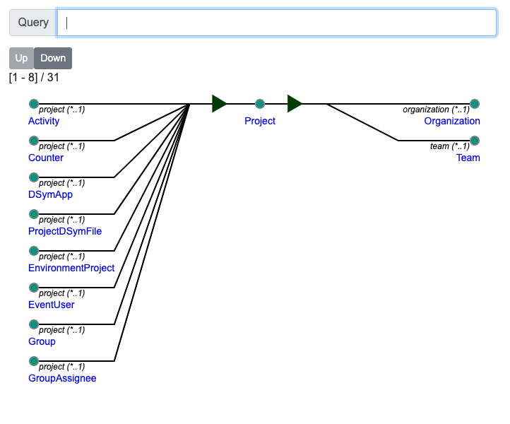

# Graphwalker

Provides graphs that you can read!



## Introduction

Graphs are are a critical abstract data type underlying much of mathematics and computer science. They provide
a fundamental model for describing newtorking, diagrams, routing, artificial intelligence, etc.

Many advanced software tools exist today to visualize graphs such as [graphviz](http://www.graphviz.org/). However,
data and concepts grow quickly. Although most visualization tools will produce impressive images, reviewing and understanding
them can be overwhelming.

`graphwalker` takes the approach of **salient** visualization:

- Renders **localized** views of a single vertex
- Adjancent vertices (1 degree of separation)
- Pagination for all incoming and outgoing arcs
- Provides reproducible navigation via:
  - Clicking on vertices within the current view
  - Type ahead search for vertex properties
- HTML5 SVG display scaling
- Cayley Graph database for incremental traversal of large graphs
- GraphQL API for vertex queries

## Requirements

You will need to install the following locally:

- [Docker](https://www.docker.com/) v19+
- [node.js](https://nodejs.org/) v6+
- [yarn](https://yarnpkg.com/en/) v0.24+

## Graph Database

### Graph Data

Currently, only the following project creates valid RDF graphs for this project:

- [django_codecrumb](https://github.com/bijanvakili/django-codecrumb)

All graph data is stored in Cayley DB. This project runs Cayley in a Docker container.

### Load Data

NOTE: Database must be initially _shut down_.

Copy your Cayley DB import file into the `./data` folder (e.g. `filename.nq.gz`) and
run the following Docker command:

    docker-compose run --rm --entrypoint "cayley load -i /import/filename.nq.gz" db

### Volume Inspection

To or manipulate the Cayley DB files, run the following:

    docker-compose run --rm shell

### Running

You can start the Cayley graph database using Docker as follows:

    docker-compose up -d db

## Web Application

### Configuration

Edit `etc/render_settings.json` to specify how to displays your graph data

```json
{
  "startVertexId": "<SHA1 vertex ID hash>",
  "vertexColumnPageSize": 8,
  "images": [
    ...
  ]
}
```

### Building

Run the following to install all the necessary build dependencies using `yarn`:

    yarn install

Run the following to build and bundle all Javascript code into the `./dist` subdirectory:

    yarn run generate
    yarn run build-server
    yarn run build-client

Then run the following to run the web server:

    GRAPHWALKER_RENDER_SETTINGS=etc/render_settings.json yarn run web

Finally, open the following URL in your web browser:

    open http://localhost:9080/

## Local Development

### Running a Test server

[tmux](https://github.com/tmux/tmux/wiki) is required to run a test server using watch mode on all source files:

    ./scripts/tmux.sh

This will run multiple watch windows for both client and server.

### git hooks

Set up the git pre-commit hook as follows:

    ln -s ../../scripts/pre-commit .git/hooks/pre-commit

### GraphQL testing

Open up the following to use the Apollo GraphQL playground, an interactive and in-browser GraphQL IDE

    open http://localhost:9080/graphql

## Cleanup

To remove build files, run the following:

    yarn run clean
